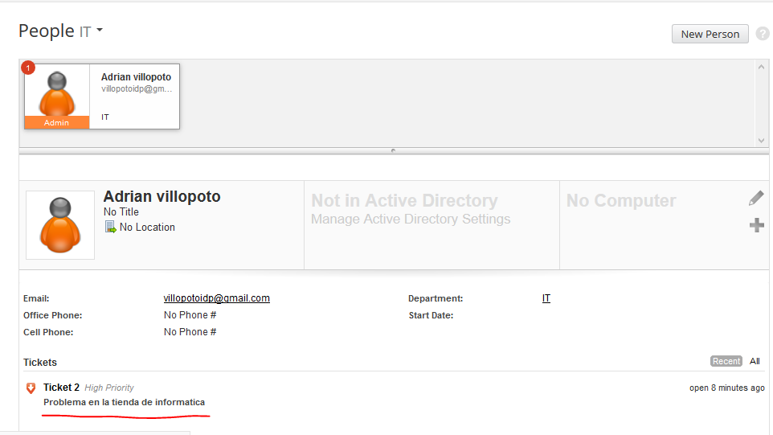
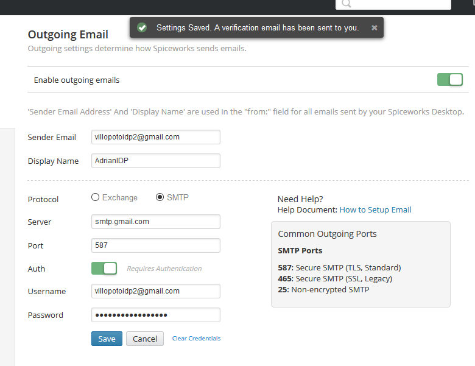

# Proyecto SPICEWORKS - ADRIÁN MACHÍN SOTO

## Instalación y uso de la herramienta - Spiceworks (creación de tickets o reportes servicio tecnico)

Una vez registrados correctamente:

Lo primero que haremos es irnos a la pagina principal de Spiceworks para descargarnos su aplicacion de escritorio.

Entramos en la pestaña Tools & Apps y descargamos la aplicacion desktop

Esperamos que cargue completamente y continuamos la instalacion

Seleccionamos el puerto 80 ya que es el puerto por defecto donde vamos a trabajar

Activamos la opcion de instalar los paquetes adicionales de Nmap y WinPCap por si nos hacen falta en un futuro

Aceptamos la ruta por defecto donde se va a guardar 

Esperamos a que termine la instalacion

Marcamos la opcion de instalacion de acceso directo en el escritorio y que se inice ahora

Se empezara a iniciar el programa cogiendo el nombre de nuestro equipo como referencia

Automaticamente se abrira el navegador y empezara a cargar el acceso a la aplicacion Spicewrok

Una vez cargado nos saldria Usuario y Contraseña que hemos creado anteriormente en Spiceworks

Al ser el primer acceso nos piden una serie de datos como para que uso es la aplicacion etc...

Entramos correctamente y ya estariamos en la pagina principal de la Spicwroks (nuestro perfil)

Pasaremos a crear un nuevo "Ticket" donde podremos avisar reportar o respoder incidencias etc

Añadimos unos datos de ejemplo para una tienda de informatica con su servicio de mantenimiento

Saldria creado el ticket a espera de ser aceptado 

En nuestro perfil como veriamos nos sale un reporte de Ticket (el creado ante)

Ahora pasariamos a configurar el aviso de reportes mediante el correo para que nos sea mejor de que podamos avisar o qu enos avisen de reporte de errores o cualquiere problema con el servidor que estemos monitorizando, ya que esta aplicacion tiene muchas herramienta y una de ellas es monitorizacion de equipos de un empresa aunque aqui no estamos viendo la monitorizacion sino la creacion de tickets.

Nos dio un error por poner los email equivocados pero ya esta resuelto ya que necesitas tu email y el email del cliente al que vas a contestar o enviar reportes (ponemos por defecto el protocolo POP)

Probamos desde el correo del cliente a enviar un correo reportando la resolucion de un problema en la empresa al tecnico de soporte 

Como vemos nos llegaria correctamente el reporte a la base de datos de Spiceworks donde nos salen todos los reportes asociados a nuestro perfil o espacio mediante tickets

Nosotros buscariamos la averia o simplemente avisariamos de la correccion del problema mediante un reporte a la empresa ya sea mediante ticket para email etc

 
Resguardo del reporte

 
Finalmente como veriamos se nos queda un resguardo del principio de la incidencia con el reporte de la empresa reportando la averia y el reporte del soporte tecnico avisando de la resolucion del problema a la empresa

