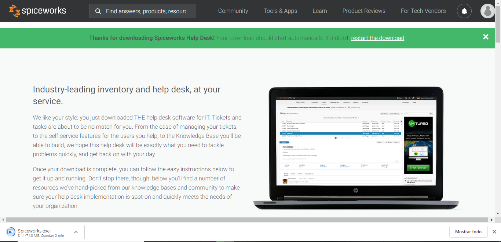

# Proyecto SPICEWORKS

## Instalacion y uso de la herramienta (creacion de tickets) en Spiceworks

Lo primero que haremos es irnos a la pagina de Spiceworks para descarganor su aplicacion de escritorio

Entramos en la pestaña Tools & Apps y descargamos la aplicacion desktop

